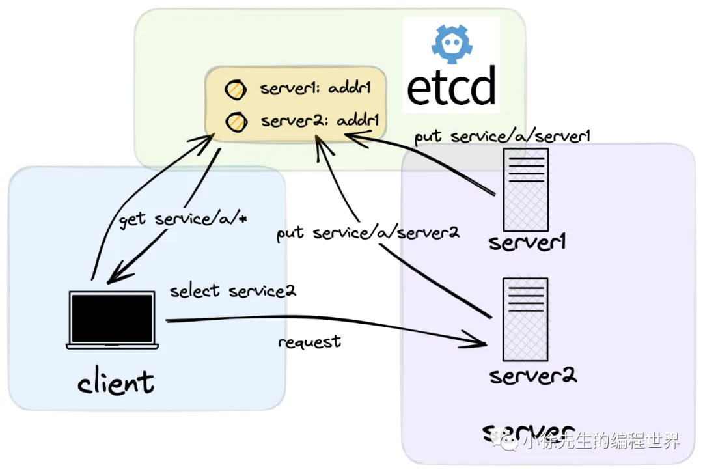
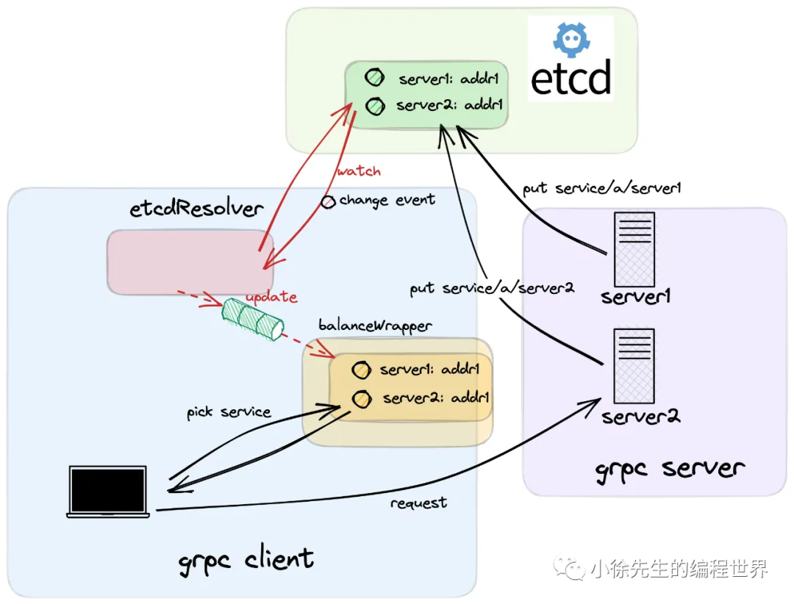

# 基于 etcd 实现 grpc 服务注册与发现

https://mp.weixin.qq.com/s/x-vC1gz7-x6ELjU-VYOTmA
本文会贴近于生产环境，使用到分布式存储组件 etcd 作为 grpc 服务的注册与发现模块，并引用 roundRobin 轮询算法作为负载均衡策略.

## 1 背景

本系列探讨的主题是由 google 研发的开源 rpc 框架 grpc-go.
对应的开源地址为：https://github.com/grpc/grpc-go/ . 走读的源码版本为 Release 1.54.0.

1. grpc 负载均衡
   C-S 架构中负载均衡策略可以分为两大类——基于服务端实现负载均衡的模式以及基于客户端实现负载均衡的模式.
   grpc-go 中采用的是基于客户端实现负载均衡的模式. 在这种模式下，`客户端会首先取得服务端的节点（endpoint）列表，然后基于一定的负载均衡策略选择到特定的 endpoint，然后直连发起请求.`
   
2. etcd 服务注册与发现
   etcd是一个分布式 KV 存储组件，协议层通过 raft 算法保证了服务的强一致性和高可用性，`同时，etcd 还提供了针对于存储数据的 watch 监听回调功能，基于这一特性，etcd 很适合用于作为配置管理中心或者服务注册/发现模块.`

   

   - 在使用 etcd 作为服务注册/发现模块时，`同一个服务组在 etcd 中会以相同的服务名作为共同的标识键前缀，与各服务节点的信息建立好映射关系`，以实现所谓的**服务注册**功能.
   - 在客户端使用**服务发现**功能时，则会在 etcd 中通过服务名取得对应的服务节点列表缓存在本地，然后在客户端本地基于负载均衡策略选择 endpoint 进行连接请求. 在这个过程中，客户端还会利用到 etcd 的 watch 功能，在服务端节点发生变化时，及时感知到变更事件，然后对本地缓存的服务端节点列表进行更新.

3. etcd-grpc
   
   etcd 是用 go 语言编写的，和 grpc-go 具有很好的兼容性.

## 2 服务端

1.  启动入口
