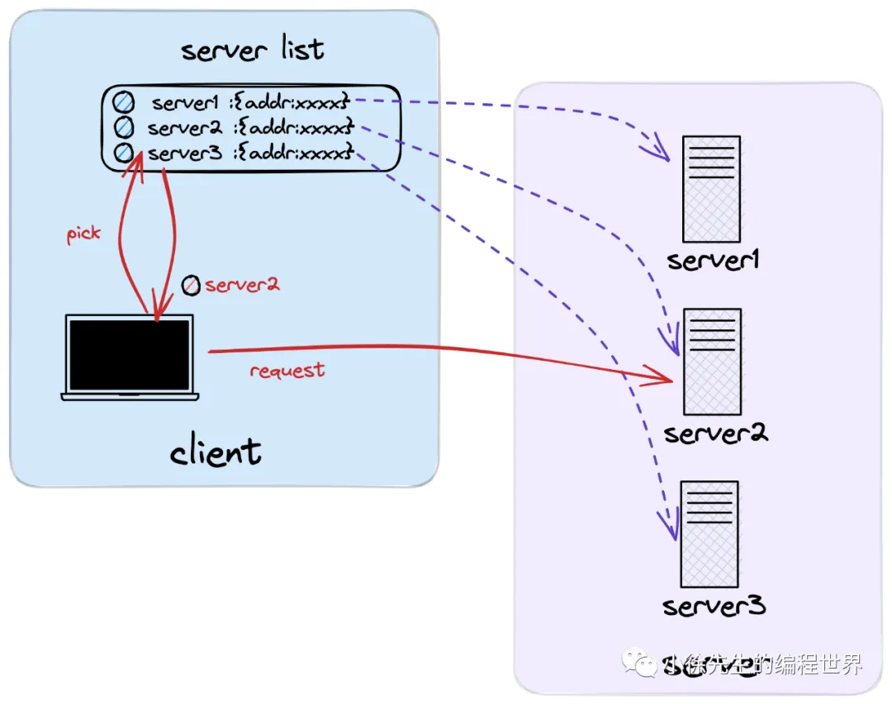

# 基于 etcd 实现 grpc 服务注册与发现

https://mp.weixin.qq.com/s/x-vC1gz7-x6ELjU-VYOTmA
本文会贴近于生产环境，使用到分布式存储组件 etcd 作为 grpc 服务的注册与发现模块，并引用 roundRobin 轮询算法作为负载均衡策略.

## 1 背景

本系列探讨的主题是由 google 研发的开源 rpc 框架 grpc-go.
对应的开源地址为：https://github.com/grpc/grpc-go/ . 走读的源码版本为 Release 1.54.0.

1. grpc 负载均衡
   C-S 架构中负载均衡策略可以分为两大类——基于服务端实现负载均衡的模式以及基于客户端实现负载均衡的模式.
   grpc-go 中采用的是基于客户端实现负载均衡的模式. 在这种模式下，`客户端会首先取得服务端的节点（endpoint）列表，然后基于一定的负载均衡策略选择到特定的 endpoint，然后直连发起请求.`
   
2. etcd 服务注册与发现
   etcd 是一个分布式 KV 存储组件，协议层通过 raft 算法保证了服务的强一致性和高可用性，`同时，etcd 还提供了针对于存储数据的 watch 监听回调功能，基于这一特性，etcd 很适合用于作为配置管理中心或者服务注册/发现模块.`

   

   - 在使用 etcd 作为服务注册/发现模块时，`同一个服务组在 etcd 中会以相同的服务名作为共同的标识键前缀，与各服务节点的信息建立好映射关系`，以实现所谓的**服务注册**功能.
   - 在客户端使用**服务发现**功能时，则会`在 etcd 中通过服务名取得对应的服务节点列表缓存在本地`，然后在客户端本地基于负载均衡策略选择 endpoint 进行连接请求. 在这个过程中，客户端还会利用到 etcd 的 watch 功能，在服务端节点发生变化时，及时感知到变更事件，然后对本地缓存的服务端节点列表进行更新.

3. etcd-grpc
   
   etcd 是用 go 语言编写的，和 grpc-go 具有很好的兼容性.

## 2 服务端

1.  启动入口
    grpc-go 服务端启动并通过 etcd 实现服务注册

    ```go
    package main

    import (
        // 标准库
        "context"
        "flag"
        "fmt"
        "net"
        "time"

        // grpc 桩代码
        "github.com/grpc_demo/proto"

        // etcd
        eclient "go.etcd.io/etcd/client/v3"
        "go.etcd.io/etcd/client/v3/naming/endpoints"

        // grpc
        "google.golang.org/grpc"
    )

    const (
        // grpc 服务名
        MyService = "xiaoxu/demo"
        // etcd 端口
        MyEtcdURL = "http://localhost:2379"
    )

    type Server struct {
        proto.UnimplementedHelloServiceServer
    }

    func main() {
        // 接收命令行指定的 grpc 服务端口
        var port int
        flag.IntVar(&port, "port", 8080, "port")
        flag.Parse()
        addr := fmt.Sprintf("http://localhost:%d", port)

        // 创建 tcp 端口监听器
        listener, _ := net.Listen("tcp", addr)

        // 创建 grpc server
        server := grpc.NewServer()
        proto.RegisterHelloServiceServer(server, &Server{})

        ctx, cancel := context.WithCancel(context.Background())
        defer cancel()
        // 注册 grpc 服务节点到 etcd 中
        go registerEndPointToEtcd(ctx, addr)

        // 启动 grpc 服务
        if err := server.Serve(listener); err != nil {
            fmt.Println(err)
        }
    }
    ```

2.  服务注册
    **registerEndPointToEtcd 方法给出了将 grpc 服务端节点注册到 etcd 模块的示例**
    

    ```go
    func registerEndPointToEtcd(ctx context.Context, addr string) {
        // 创建 etcd 客户端
        etcdClient, _ := eclient.NewFromURL(MyEtcdURL)
        etcdManager, _ := endpoints.NewManager(etcdClient, MyService)

        // 创建一个租约，每隔 10s 需要向 etcd 汇报一次心跳，证明当前节点仍然存活
        var ttl int64 = 10
        lease, _ := etcdClient.Grant(ctx, ttl)

        // 添加注册节点到 etcd 中，并且携带上租约 id
        _ = etcdManager.AddEndpoint(ctx, fmt.Sprintf("%s/%s", MyService, addr), endpoints.Endpoint{Addr: addr}, eclient.WithLease(lease.ID))

        // 每隔 5 s进行一次延续租约的动作
        for {
            select {
            case <-time.After(5 * time.Second):
                // 续约操作
                resp, _ := etcdClient.KeepAliveOnce(ctx, lease.ID)
                fmt.Printf("keep alive resp: %+v", resp)
            case <-ctx.Done():
                return
            }
        }
    }
    ```

3.  注册节点
    将服务节点 endpoint `以共同的服务名作为标识键 key 的前缀`，添加到 kv 存储介质当中

```go
func (m *endpointManager) AddEndpoint(ctx context.Context, key string, endpoint Endpoint, opts ...clientv3.OpOption) error {
    return m.Update(ctx, []*UpdateWithOpts{NewAddUpdateOpts(key, endpoint, opts...)})
}

func (m *endpointManager) Update(ctx context.Context, updates []*UpdateWithOpts) (err error) {
    ops := make([]clientv3.Op, 0, len(updates))
    for _, update := range updates {
        if !strings.HasPrefix(update.Key, m.target+"/") {
            return status.Errorf(codes.InvalidArgument, "endpoints: endpoint key should be prefixed with '%s/' got: '%s'", m.target, update.Key)
        }

        switch update.Op {
        case Add:
            internalUpdate := &internal.Update{
                Op:       internal.Add,
                Addr:     update.Endpoint.Addr,
                Metadata: update.Endpoint.Metadata,
            }

            var v []byte
            if v, err = json.Marshal(internalUpdate); err != nil {
                return status.Error(codes.InvalidArgument, err.Error())
            }
            ops = append(ops, clientv3.OpPut(update.Key, string(v), update.Opts...))
            // ...
        }
    }
    _, err = m.client.KV.Txn(ctx).Then(ops...).Commit()
    return err
}
```

## 3 客户端

1. 启动入口
   grpc-go 客户端启动的代码示例

   ```go
   package main

   import (
       // 标准库
       "context"
       "fmt"
       "time"

       // grpc 桩文件
       "github.com/grpc_demo/proto"

       // etcd
       eclient "go.etcd.io/etcd/client/v3"
       eresolver "go.etcd.io/etcd/client/v3/naming/resolver"

       // grpc
       "google.golang.org/grpc"
       "google.golang.org/grpc/balancer/roundrobin"
       "google.golang.org/grpc/credentials/insecure"
   )

   const MyService = "xiaoxu/demo"

   func main() {
       // 创建 etcd 客户端
       etcdClient, _ := eclient.NewFromURL("my_etcd_url")

       // 创建 etcd 实现的 grpc 服务注册发现模块 resolver
       etcdResolverBuilder, _ := eresolver.NewBuilder(etcdClient)

       // 拼接服务名称，需要固定义 etcd:/// 作为前缀
       etcdTarget := fmt.Sprintf("etcd:///%s", MyService)

       // 创建 grpc 连接代理
       conn, _ := grpc.Dial(
           // 服务名称
           etcdTarget,
           // 注入 etcd resolver
           grpc.WithResolvers(etcdResolverBuilder),
           // 声明使用的负载均衡策略为 roundrobin     grpc.WithDefaultServiceConfig(fmt.Sprintf(`{"LoadBalancingPolicy": "%s"}`, roundrobin.Name)),
           grpc.WithTransportCredentials(insecure.NewCredentials()),
       )
       defer conn.Close()

       // 创建 grpc 客户端
       client := proto.NewHelloServiceClient(conn)
       for {
           // 发起 grpc 请求
           resp, _ := client.SayHello(context.Background(), &proto.HelloReq{
               Name: "xiaoxuxiansheng",
           })
           fmt.Printf("resp: %+v", resp)
           // 每隔 1s 发起一轮请求
           <-time.After(time.Second)
       }
   }
   ```

2. 注入 etcd resolver

etcd 实现的 resolverBuilder 源码如下，其中内置了一个 etcd 客户端用于获取 endpoint 注册信息

```go
type builder struct {
    c *clientv3.Client
}

func (b builder) Scheme() string {
    return "etcd"
}

// NewBuilder creates a resolver builder.
func NewBuilder(client *clientv3.Client) (gresolver.Builder, error) {
    return builder{c: client}, nil
}
```

3. 启动 grpc balancerWrapper
   在 grpc-go 客户端启动时，会调用方法链 DialContext -> newCCBalancerWrapper -> go ccBalancerWrapper.watcher
   启动一个 balancerWrapper 的守护协程，持续监听 ClientConn 更新、balancer 更新等事件并进行处理

   ```go
   func DialContext(ctx context.Context, target string, opts ...DialOption) (conn *ClientConn, err error) {
       cc.balancerWrapper = newCCBalancerWrapper(cc, balancer.BuildOptions{
           DialCreds:        credsClone,
           CredsBundle:      cc.dopts.copts.CredsBundle,
           Dialer:           cc.dopts.copts.Dialer,
           Authority:        cc.authority,
           CustomUserAgent:  cc.dopts.copts.UserAgent,
           ChannelzParentID: cc.channelzID,
           Target:           cc.parsedTarget,
       })

       return cc, nil
   }

   func newCCBalancerWrapper(cc *ClientConn, bopts balancer.BuildOptions) *ccBalancerWrapper {
       ccb := &ccBalancerWrapper{
           cc:       cc,
           updateCh: buffer.NewUnbounded(),
           resultCh: buffer.NewUnbounded(),
           closed:   grpcsync.NewEvent(),
           done:     grpcsync.NewEvent(),
       }
       go ccb.watcher()
       ccb.balancer = gracefulswitch.NewBalancer(ccb, bopts)
       return ccb
   }

   func (ccb *ccBalancerWrapper) watcher() {
       for {
           select {
           case u := <-ccb.updateCh.Get():
               switch update := u.(type) {
               case *ccStateUpdate:
                   ccb.handleClientConnStateChange(update.ccs)
               case *switchToUpdate:
                   ccb.handleSwitchTo(update.name)
                // ...
               }
           case <-ccb.closed.Done():
                //
           }
       }
   }
   ```

4. 获取 etcd resolver builder

5. 创建并启动 etcd resolver
   
   被构建出来的 etcd resolver 定义如下：

   ```go
   type resolver struct {
       // etcd 客户端
       c      *clientv3.Client
       target string
       // grpc 连接代理
       cc     gresolver.ClientConn
       // !持续监听的 etcd chan，能够获取到服务端 endpoint 的变更事件
       wch    endpoints.WatchChannel
       ctx    context.Context
       cancel context.CancelFunc
       wg     sync.WaitGroup
   }
   ```

   在 etcd resolver builder 构建 resolver 的过程中，会获取到一个来自 etcd 客户端的 channel，
   用于**持续监听 endpoint 的变更事件**，以维护更新客户端缓存的 endpoint 列表，保证 grpc-go 客户端维护到最新的 endpoint 实时数据.

## 4 总结

本文`以 etcd 作为 grpc 的服务注册/发现模块，round-robin 作为负载均衡策略，以 grpc 客户端的运行链路为主线`，进行了原理分析和源码走读：

- grpc 客户端启动过程中会依次构造 `balancer` 和 `resolver`，并开启守护协程对状态变更事件进行监听和处理
- 构造 **etcd resolver 并开启守护协程 watcher 进行服务端 endpoints 更新事件的监听**
- 负载均衡器 **balancer 的守护协程会接收到来自 resolver 传递的 endpoints 列表，对本地缓存的数据进行更新**
- grpc 客户端发起请求时，会通过 round-robin 算法，**对负载均衡器中缓存的 endpoints 轮询使用**
